# Insurance CRM — Complete Guide

A plain-English tour of the whole app: what every screen does, how the day-to-day
flows work, and — importantly — **where your data lives and what does (and does not)
leave your computer.**

> **The one-line summary:** everything runs on *your* PC. Your client data (including
> Aadhaar/PAN) is stored locally and encrypted. The only things that ever go out are
> (1) AI requests to Claude — and only non-sensitive facts, never Aadhaar/PAN — and
> (2) WhatsApp messages you send, from your own number.

---

## 1. The big picture

You open the app in your browser at **http://localhost:3000**. Behind the scenes a small
program (the "server") runs on your own Windows PC, reads and writes a single database
file, and shows you the screens below. Nothing is on the internet unless you send it.

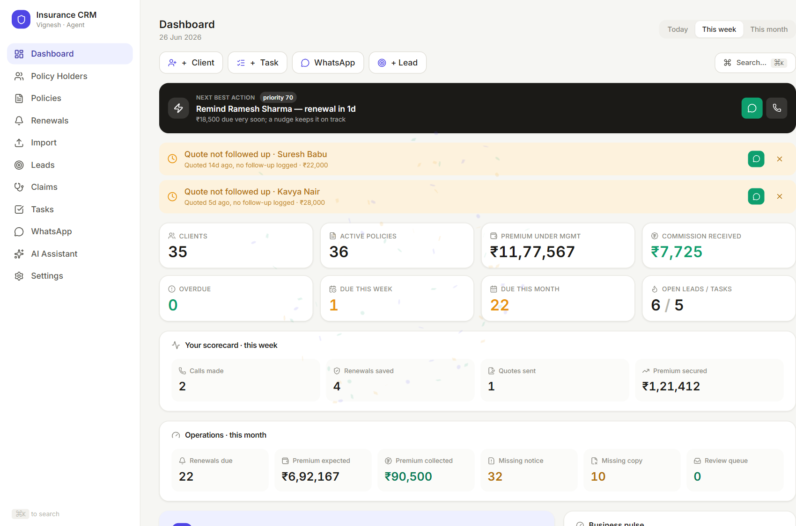

The **left sidebar** is your map. Top to bottom:

| Menu | What it's for |
|---|---|
| **Dashboard** | Your morning overview — what needs attention, money at risk, today's plan |
| **Policy Holders** | Every client, their policies, documents, family, and KYC vault |
| **Policies** | All policies across all clients in one list |
| **Renewals** | Everything coming up or overdue, with one-click reminders |
| **Import** | Bulk-load renewals from Excel + auto-read policy/renewal PDFs |
| **Leads** | Your sales pipeline (New → Contacted → Quoted → Won/Lost) |
| **Claims** | *(coming later)* |
| **Tasks** | Your to-dos and reminders |
| **WhatsApp** | Connect your number and send messages |
| **AI Assistant** | Ask questions about your book and draft messages |
| **Settings** | Backups, your details, reminder preferences |

---

## 2. The screens, one by one

### Dashboard
Your starting point each day. It reads everything once and shows you:
- **Next best action** + **alerts** — the single most important thing, and warnings
  (high-value overdue renewals, quotes you haven't followed up).
- **KPIs** — clients, active policies, premium under management, commission.
- **Scorecard** + **Operations** — what you've done this week, and renewal workflow health
  (premium expected vs collected, how many policies are missing a notice or copy).
- Lower down: an **AI morning briefing**, business-health score, money-at-risk list,
  activity streak, smart actions, priority accounts, cross-sell ideas and more.
- Top-right **Today / This week / This month** switches the time window.

### Policy Holders
The master list of everyone you serve. Search by name or phone; click anyone to open
their folder.

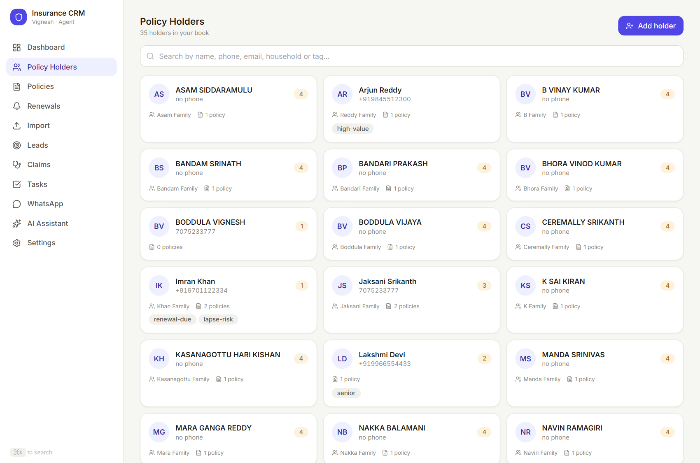

### The Policy-Holder folder (profile)
Everything about one person, in tabs:
- **Overview** — an at-a-glance summary, key stats, and open tasks.
- **Policies** — every policy they own (with yearly versions).
- **Documents** — neatly bucketed: Policy Copies / Renewal Notices / KYC / Claims / Other.
- **Vault** — Aadhaar/PAN and KYC, **masked** by default, revealed only on click.
- **Family** — household members and policies they're also covered on.
- **Timeline** — every message, call and upload in date order.

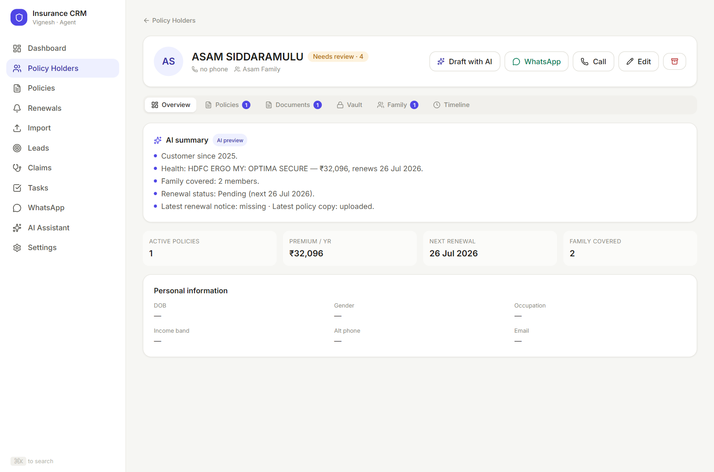

The buttons up top — **✨ Draft with AI**, **WhatsApp**, **Call**, **Edit** — act on that person.

### Renewals
The board you'll live in. Grouped **Overdue / This week / This month / Later**, with the
premium-at-risk total. Each row has a **✨ Draft** button (AI message), a quick WhatsApp
link, and **Renewed** (which rolls the due date forward a year).

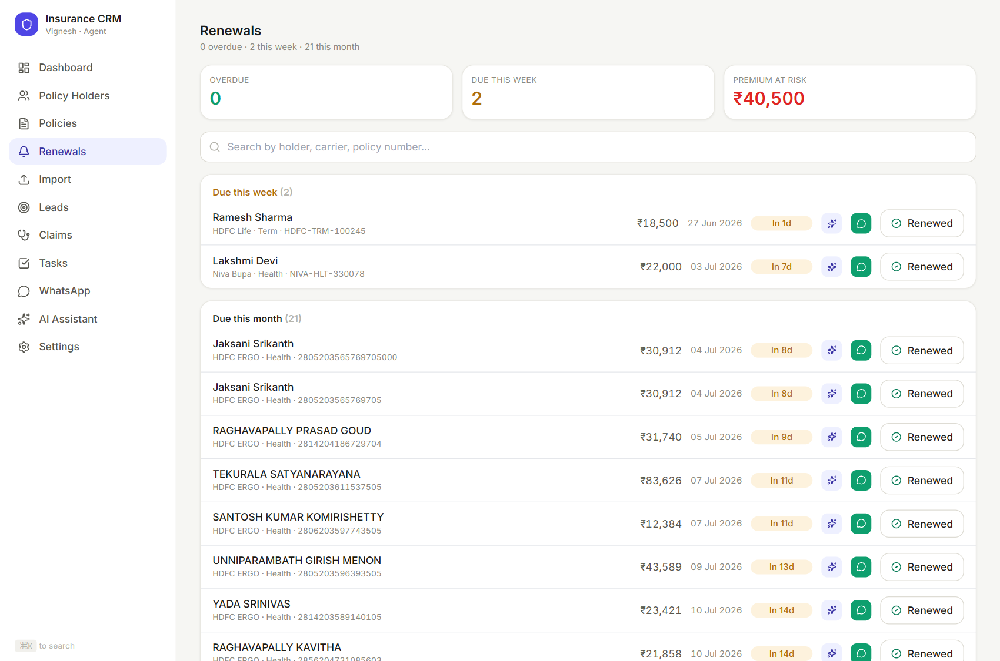

### Import
Two ways to bulk-load:
1. **Excel** (HDFC ERGO renewal sheets) — auto-detected, matched to existing clients,
   never duplicated.
2. **Policy/renewal PDFs** — drop a folder of PDFs; the app reads each one, extracts the
   policy number, premium and due date, **auto-attaches** confident matches to the right
   client (≥90% sure), and puts the rest in a **Review Queue** for you to confirm.

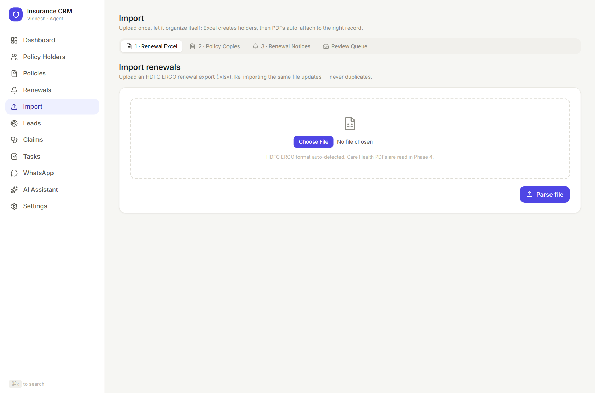

### Leads
Your sales pipeline as columns. Each card shows the person, their interest, and expected
premium. Move a lead forward one tap at a time, mark it lost, message them, or — when
you win — **convert it into a Policy Holder** in one click.

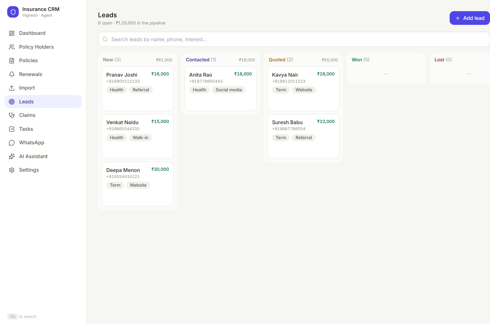

### Tasks
Simple to-dos grouped Overdue / Today / Upcoming / Done. Birthdays of clients and their
family members appear here automatically.

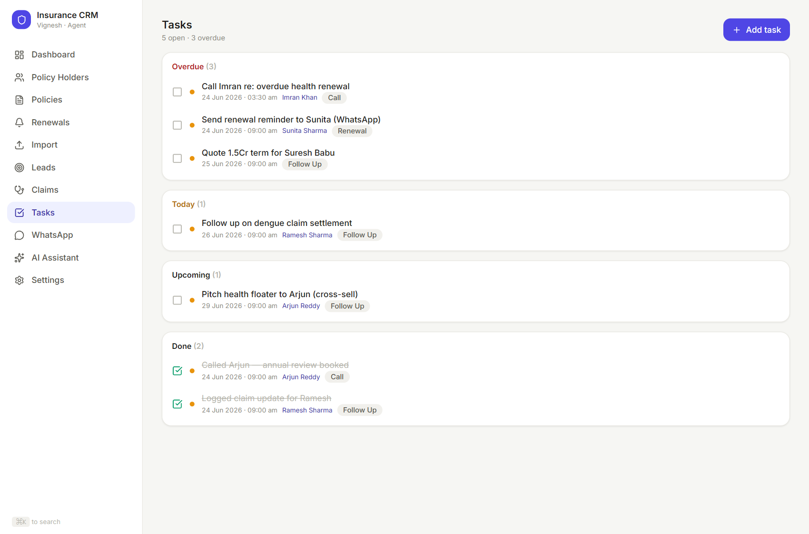

### WhatsApp
Link your own WhatsApp once (scan a QR with your phone), then send messages and policy
files straight from the CRM. Every send is **logged** to that client's history.

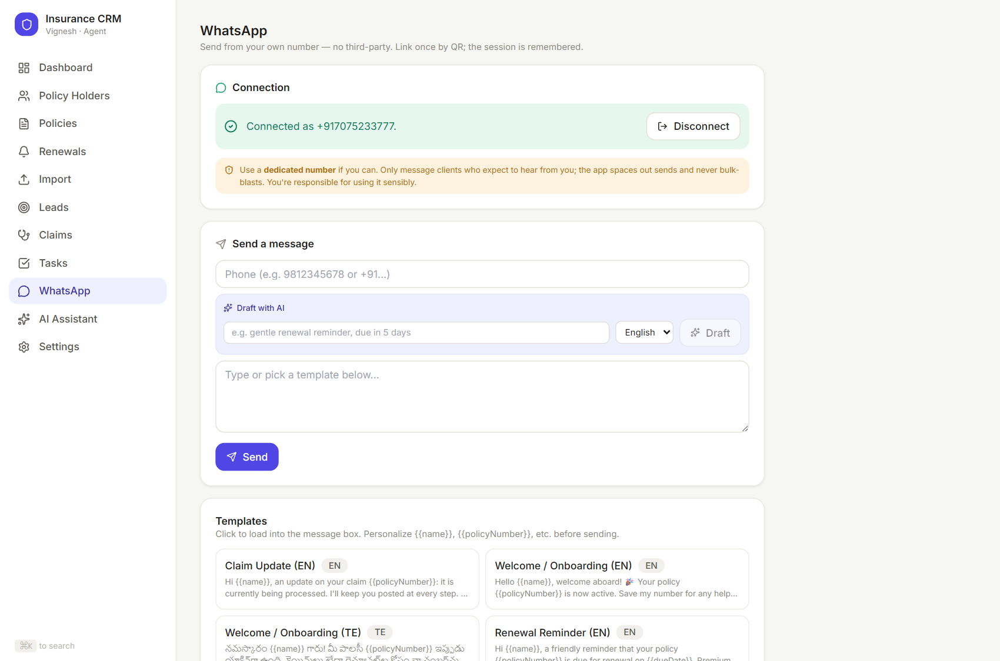

### AI Assistant
A chat that can *see your live book* (names, policies, renewals, leads, tasks — **never**
your Aadhaar/PAN). Ask things like *"Who has no health cover?"*, *"What needs my attention
today?"*, or *"Draft a renewal reminder for my most overdue client in Telugu."*

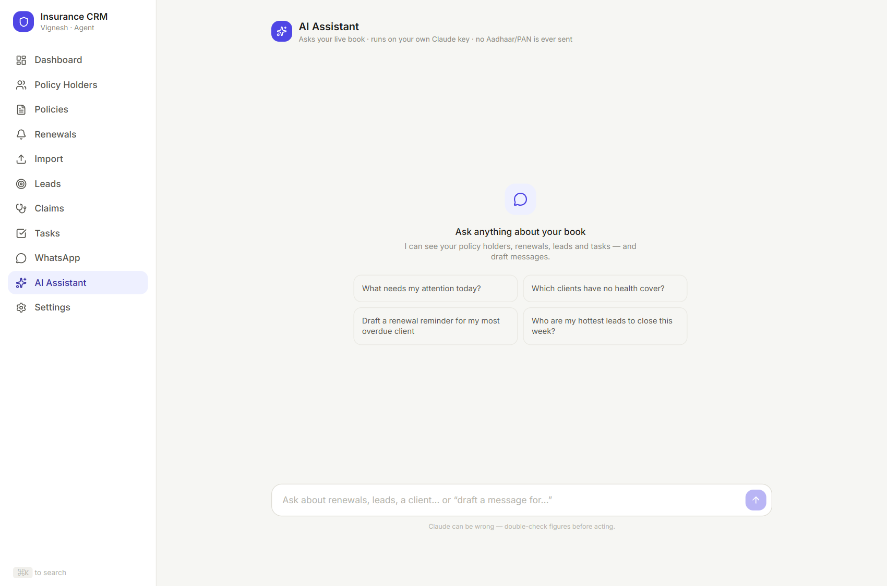

### Settings
Encrypted **backups** and **restore**, a plain **data export**, your own contact/social
details, and reminder preferences (how many days before a birthday/renewal to nudge).

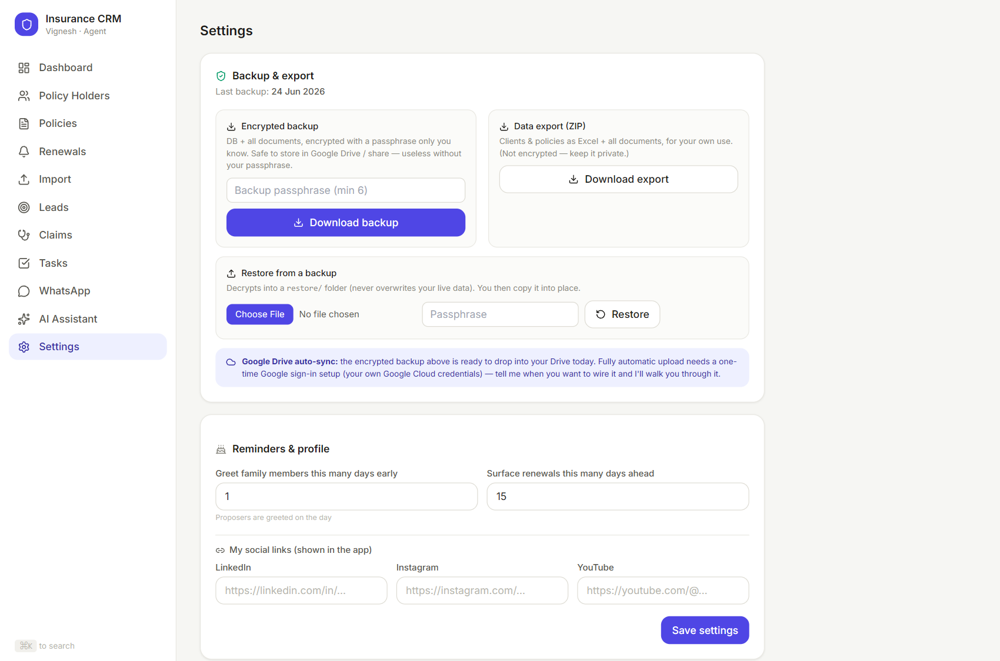

---

## 3. The everyday flows

### A. Your morning
1. Open the app → **Dashboard**.
2. Read the **AI briefing** and **Next best action** at the top.
3. Click into **Renewals** to clear what's overdue/due.

### B. Renewal reminder in one tap (the headline flow)
1. On **Renewals** (or a client's profile), click **✨ Draft**.
2. The app instantly writes a message using that client's real name, policy number,
   premium and due date — in **English or Telugu**. Edit if you like.
3. Optionally attach their **policy copy / renewal notice** with the paperclip.
4. Click **Send on WhatsApp** — it sends from your number **and logs it** to their Timeline.

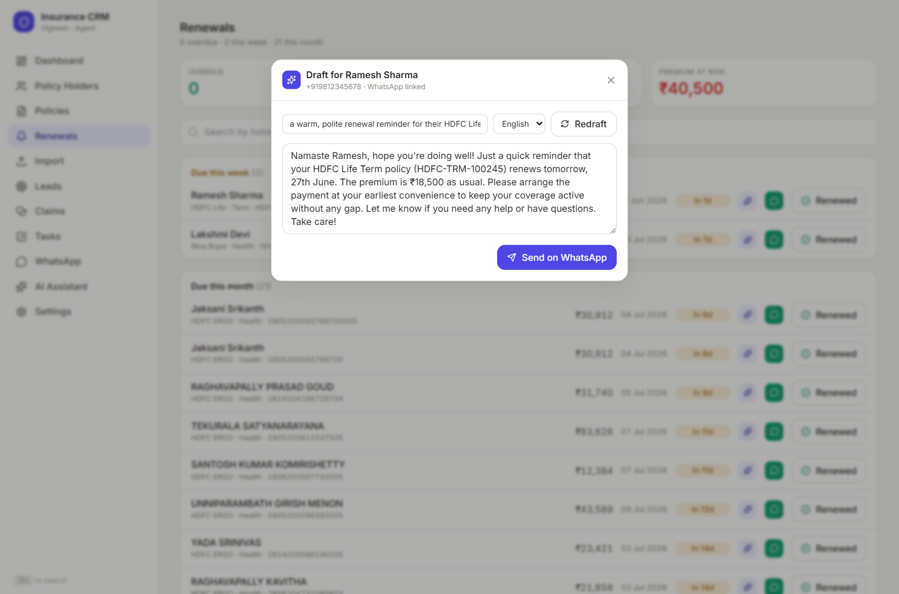

> If WhatsApp isn't connected at that moment, the button becomes **Open in WhatsApp**
> (wa.me) so you can still send manually — nothing breaks.

### C. Loading a batch of renewals
1. **Import** → upload the Excel sheet and/or a folder of policy/renewal PDFs.
2. The app reads them, **auto-attaches** the confident matches, and shows a **Review Queue**.
3. Confirm the uncertain ones (it remembers your choices for next time).

### D. Upload & scan a single document
1. On a client's **Documents** tab, choose **Upload & Scan**.
2. The app reads the file, updates the policy's premium/due date if newer, files it in the
   right bucket, and shows you a "fields updated" summary — no manual typing.

### E. Working a lead to a sale
1. **Leads** → **Add lead**, or move an existing one along the pipeline.
2. When you win it, click **Convert to policy holder** — it becomes a real client and opens
   their new folder, ready for policies.

---

## 4. How your data flows (and where it lives)

Here's the whole system. Solid lines stay **on your PC**; dotted lines are the **only**
things that go out — and only when you act.

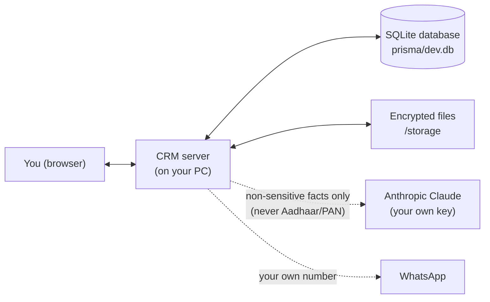

If your viewer doesn't draw the diagram above, here it is in words:

```
  You (browser)
        │  (stays on your PC)
        ▼
  CRM server  ──►  SQLite database file  (all client/policy/lead/task data)
        │     └─►  /storage              (uploaded documents, encrypted)
        │
        ├ ─ ─►  Claude AI     — only when you use an AI feature; sends names,
        │                       policies, renewals, leads, tasks. NEVER Aadhaar/PAN.
        │
        └ ─ ─►  WhatsApp      — only when you press Send; from your own number.
```

**What this means in practice:**
- **All your data sits in one file on your PC** — `prisma/dev.db`. Backing that up (plus
  `/storage` and `.env`) backs up everything.
- **Aadhaar, PAN and uploaded documents are encrypted** before they're saved (AES‑256, the
  same standard banks use). On screen, IDs are masked (e.g. `XXXX XXXX 1234`) until you
  click to reveal. The encryption key lives in your `.env` file and never leaves the PC.
- **The AI only ever receives non-sensitive facts.** Before any text is sent to Claude, the
  app also scrubs anything that looks like an Aadhaar or PAN number, as a second safety net.
  AI runs on *your* Anthropic key; if the key is blank, the AI features simply turn off and
  everything else keeps working.
- **WhatsApp uses your own linked number** — there's no third-party messaging company in the
  middle, which is why there's no monthly fee.

---

## 5. Where things are on disk

Inside the project folder:

| Path | What it holds |
|---|---|
| `prisma/dev.db` | **The database** — every client, policy, lead, task, message |
| `/storage` | Uploaded documents, **encrypted** |
| `.env` | Your secret keys (encryption key, Anthropic API key) — never share this |
| `.wwebjs_auth` | Your saved WhatsApp login (so you don't re-scan each time) |
| `docs/` | This guide and its screenshots |
| `Start CRM.cmd` | Double-click to run the app (no terminal needed) |

> `prisma/dev.db`, `/storage` and `.env` are deliberately kept out of any code sharing —
> they hold your private data and secrets.

---

## 6. Keeping it safe

- **Backups:** Settings → make an **encrypted backup** (database + documents, locked with a
  passphrase you choose). Keep a copy on a USB drive or your own cloud. **Restore** brings it
  back. Do this regularly — it's your safety net if the PC fails.
- **The `.env` file is the master key.** If you lose it, encrypted data can't be recovered.
  Keep it (and your backup passphrase) somewhere safe.
- **Treat the PC like a vault.** Since everything is local, the security of your client data
  is the security of this computer — use a login password and don't leave it unlocked.

---

## 7. Running the app

You don't need the terminal:
- Double-click the **Insurance CRM** icon on your Desktop (or **`Start CRM.cmd`**).
- Keep the black window open while you work; close it to quit.
- After any update to the app, double-click **`Update CRM.cmd`** once, then start as usual.
- Full instructions are in **`START HERE.txt`**.

That's the whole system. Everything you see flows from one local database, protected on your
own machine, with AI and WhatsApp as opt-in helpers you control.
